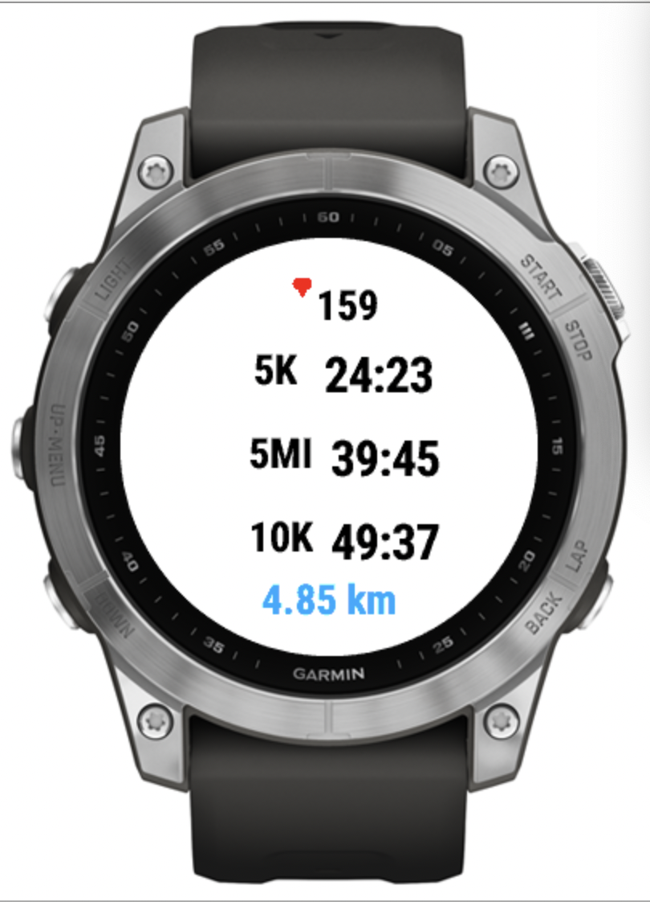

# Race Estimator

> NOTE: Initial BETA release — use and test at your own discretion. Report issues in the repository issues tracker.

Race Estimator is a compact Garmin Connect IQ data field that predicts finish times for nine common race milestones in real time and surfaces three concise predictions on-screen. It's designed for accuracy, low CPU/battery use, and safe rendering on both MIP and AMOLED devices.

## Screenshot



Why use it

- Provides continuously-updating finish time estimates for milestones (5K, 10K, half, marathon, etc.) while you run.
- Shows only the most relevant information: three milestone predictions at a time with a simple status line.

Highlights — what the data field does

- Inputs: GPS-derived elapsed distance and timestamps (Activity.Info), optional user profile for unit conversions.
- Outputs: up to three milestone predictions formatted as time-to-finish (m:ss or h:mm:ss) and a short status (WAITING GPS, WARMUP, PREDICTING, FINISHED).
- UI: compact 3-row display designed for single-field layouts; AMOLED-safe colors and periodic position shifts to reduce burn-in.
- Behavior: predictions start after a short warmup (requires ≥100 m of distance and a smoothing window). As milestones are hit the display rotates to the next upcoming milestones.
- Constraints: compute() is optimized to avoid dynamic allocations and run every second; avoid heavy work in onUpdate().
- Edge cases handled: GPS accuracy checks, minimum-distance gating to avoid wildly inaccurate early predictions, FIT anomaly detection (distance stagnation and pace spikes), and time-skip mitigations.

Recent changes (2025-10-21)

- Dynamic milestone centering: milestone label+time pairs are now centered as a single group based on the display width (no absolute X offsets). This makes the UI consistent across different screen sizes and resolutions.
- Increased spacing between milestone label and time for improved readability (30px padding between elements).
- Vibration feedback on milestone completion: the watch now emits a short tactile pulse when a milestone is reached. Vibration is implemented inside `MilestoneManager` so the celebration logic and UI remain separated.

Key facts

- Runtime manifest minApiLevel: 5.0.0
- Recommended development SDK: 5.2.0+ (source uses nullable types, Double literals, and modern Monkey C conveniences)
- Storage version in source: `STORAGE_VERSION = 4`

Quick start — install a prebuilt binary

1. Open `build/` and pick the binary that matches your device (e.g., `RaceEstimator-fenix7.prg`, `RaceEstimator-fr255s.prg`).
2. Copy the `.prg` to your watch `GARMIN/Apps` folder (macOS: use Android File Transfer or MTP tool).

## Sideloading the `.prg` to a device (detailed)

Below are step-by-step instructions for copying a built `.prg` onto a Garmin device across common platforms and how to use the Connect IQ Simulator for testing.

macOS

- Recommended: Use OpenMTP (https://openmtp.ganeshrvel/) or Android File Transfer.
- Steps:
  1. Connect the device with a USB cable.
  2. Open OpenMTP / Android File Transfer and wait for the device to appear.
  3. In the device view, open the `GARMIN/Apps` folder.
  4. Drag the `.prg` file (for example `RaceEstimator-fenix7.prg`) into `GARMIN/Apps`.
  5. Eject the device from OpenMTP and unplug the cable.
  6. On the watch, add the data field to an activity screen (Settings → Activities & Apps → choose activity → Data Screens → Add).

Command-line (when device is mounted at `/Volumes/GARMIN`):

```bash
cp build/RaceEstimator-fenix7.prg /Volumes/GARMIN/Apps/
diskutil eject /Volumes/GARMIN
```

Windows

- Use Windows Explorer when the device is connected by USB (it will appear as an MTP device).
- Steps:
  1. Connect the device via USB.
  2. Open File Explorer and look for the device under "This PC" (may appear as a MTP device).
  3. Navigate to `GARMIN/Apps`.
  4. Copy the `.prg` into the `Apps` folder.
  5. Safely eject the device and disconnect the cable.

Linux

- Use `mtp-tools`, `jmtpfs`, or a file manager that supports MTP to access the device.
- Example with `jmtpfs`:
  1. Install: `sudo apt install jmtpfs`
  2. Create a mount point: `mkdir ~/garmin`
  3. Mount your device: `jmtpfs ~/garmin`
  4. Copy the PRG: `cp build/RaceEstimator-fenix7.prg ~/garmin/GARMIN/Apps/`
  5. Unmount: `fusermount -u ~/garmin`

Connect IQ Simulator (recommended for iterative testing)

- The Connect IQ IDE / Simulator is the fastest way to iterate. It installs the app automatically when you run from the IDE.
- You can also drag the compiled `.prg` onto the simulator window to install it.
- Use `System.println("[RaceEst] ...")` in the code to print debugging output in the simulator console.

Troubleshooting

- Device not visible: try a different USB cable or port. On macOS prefer OpenMTP over Android File Transfer if you see issues.
- "Invalid app" on the watch: make sure you built and signed with a valid developer key (`-y` parameter to `monkeyc`).
- Permission denied reading key during build: ensure developer key file permissions allow read by you (`chmod 600`).
- Watch won't show the data field: ensure the `.prg` file is in `GARMIN/Apps` and that the watch model is supported by the build target.

If you want, I can add a small shell script to automate building for several targets and copying to a mounted device path.

Build from source (developer)

- Requirements: Garmin Connect IQ SDK (recommended 5.2.0+), `monkeyc` CLI, and your Connect IQ developer key.
- Example build commands (replace device id where shown):

```bash
# Build for fenix7
monkeyc -o bin/RaceEstimator-fenix7.prg -f monkey.jungle \
  -y ~/.Garmin/ConnectIQ/developer_key.der -d fenix7

# Build for fr255s
monkeyc -o bin/RaceEstimator-fr255s.prg -f monkey.jungle \
  -y ~/.Garmin/ConnectIQ/developer_key.der -d fr255s

# Build for venu2plus
monkeyc -o bin/RaceEstimator-venu2plus.prg -f monkey.jungle \
  -y ~/.Garmin/ConnectIQ/developer_key.der -d venu2plus
```

Developer key (important)

- Never commit your developer key.
- Recommended location: `~/.Garmin/ConnectIQ/developer_key.der` (the `-y` flag accepts a path).
- Secure the key: `chmod 600 ~/.Garmin/ConnectIQ/developer_key.der`
- For CI: store the DER file as a secret and write it into `~/.Garmin/ConnectIQ/` during the job, then remove it.

Usage (on the watch)

1. Add the "Race Estimator" data field to a running activity screen.
2. Use a 1-field or compact layout for best visibility.
3. Wait for GPS lock; the data field requires ≥100 m of recorded distance and a short smoothing window before stable predictions appear.

Supported / tested targets

- See `manifest.xml` for the authoritative product list. Common targets used during development and testing include:
  - Fenix 7 family (fenix7, fenix7pro, fenix7s, fenix7x, ...)
  - Fenix 8 family (selected Pro/solar variants)
  - Forerunner 255 series (fr255, fr255m, fr255s)
  - Venu 2 Plus (AMOLED)

Why 5.2.0+ as recommended SDK?

- The project uses modern Monkey C features (nullable types, Double literals, Lang.format) that are more ergonomic on SDK 5.2.0+. The manifest minApiLevel remains 5.0.0 so runtime compatibility is preserved.

Troubleshooting

- "Unable to load private key: ${workspaceFolder}/developer_key": make sure `monkeyC.developerKeyPath` in your editor points to `~/.Garmin/ConnectIQ/developer_key.der` or pass `-y <path>` to `monkeyc`.
- Permission denied reading the key: ensure `chmod 600` is set and the file is readable by you.
- Build fails for a device: verify the device id passed to `-d` matches an id in `manifest.xml` or change the target in `monkey.jungle`.
- Simulator logs: use `System.println("[RaceEst] ...")` in source to print messages in the simulator/IDE console.

Where to look next (short)

- Core logic and behavior: `source/RaceEstimatorView.mc`
- App bootstrap: `source/RaceEstimatorApp.mc`
- Runtime targets and minApiLevel: `manifest.xml`
- UI/arc design: `docs/race_estimator_arc_specification.md`

Testing & validation

- The project includes validation scripts under `scripts/` (FIT/GPX analysis) and some prebuilt test binaries under `build/`.

Contributing (quick rules)

- Avoid allocations in `compute()` and other hot paths.
- Gate debug logs behind a `DEBUG` flag.
- Test on both MIP and AMOLED devices when changing rendering.
- Bump `STORAGE_VERSION` when you change persistent storage layout and include a migration plan.

License

- This project is licensed under the MIT License — see `LICENSE`.

If you'd like, I can also add a short CONTRIBUTING.md and a CI build example that injects the developer key from secrets.
